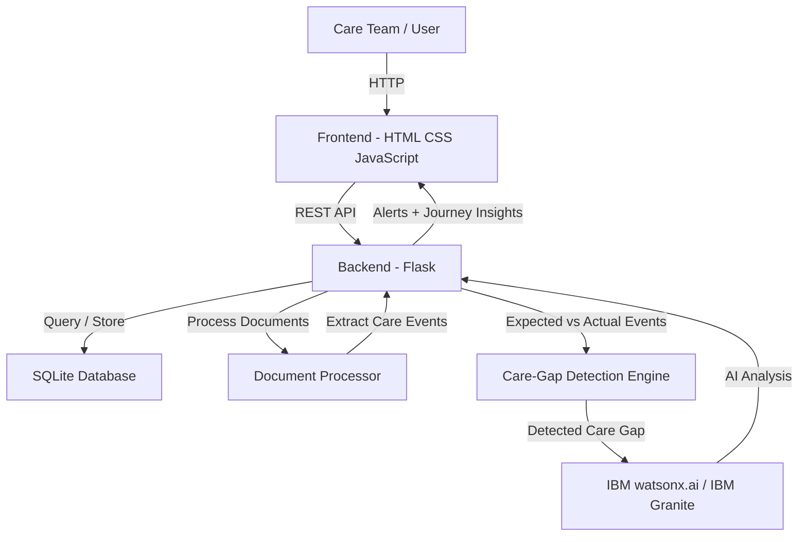

# Architecture

## System Architecture

CareSentinel is a web-based healthcare care-gap monitoring system consisting of a frontend interface, Flask backend, SQLite database, care-gap detection engine, document processing layer, and optional IBM watsonx.ai / IBM Granite integration.

The architecture is designed to separate user interaction, application logic, data storage, care-process detection, document processing, and AI analysis.

## Components

| Component | Technology | Responsibility |
|---|---|---|
| Frontend | [HTML, CSS, JavaScript] | [Patient overview, care journey, documents, alerts, event management, and user interaction.] |
| Backend API | [Python, Flask] | [REST APIs, business logic, patient management, event management, document processing, and AI orchestration.] |
| AI / ML | [IBM watsonx.ai + IBM Granite] | [Analyzes detected care gaps and generates summaries, explanations, confidence information, and suggested next care-process actions.] |
| Database | [SQLite] | [Stores patients, healthcare events, alerts, and uploaded document metadata.] |

## Data Flow

[A caregiver or care-team user records a healthcare event or uploads a healthcare document through the frontend.]
[The frontend sends the relevant information to the Flask backend through REST APIs.]
[The backend stores patient, event, alert, and document information in the SQLite database.]
[When a document is uploaded, the document-processing layer extracts relevant information and converts applicable information into care events.]
[The care-gap detection engine reconstructs the patient's chronological care journey and evaluates expected relationships between events.]
[If an expected event is missing or delayed beyond its defined time window, the system creates a care-gap alert with an appropriate priority.]
[When IBM watsonx.ai credentials are configured, the detected care gap is sent to IBM watsonx.ai using an IBM Granite model for AI-powered analysis.]
[The AI analysis produces an understandable explanation, summary, confidence information, and suggested next care-process action.]
[The backend returns the care journey, alerts, and AI insights to the frontend.]
[The user can review the patient's complete journey and understand where the care process may have broken.]

## Security Considerations

[IBM watsonx.ai API credentials are stored using environment variables rather than hard-coded in source code.
Real API keys and secrets should never be committed to the GitHub repository.
The project includes an .env.example file to document required environment variables without exposing credentials.
The prototype uses synthetic demonstration data and does not require real patient information.
CareSentinel is designed as a care-process monitoring system and does not make medical diagnosis or treatment decisions.]

## Scalability Notes

[The current implementation uses Flask and SQLite because they are lightweight and suitable for a hackathon prototype.

For a production-scale deployment, the architecture could be extended by:

Replacing SQLite with a scalable managed relational database.
Running the Flask backend behind a production application server and load balancer.
Adding authentication and role-based access control for patients, caregivers, and healthcare teams.
Using background processing for large document uploads and AI requests.
Adding monitoring, logging, and audit trails.
Scaling IBM watsonx.ai requests according to application workload.
Introducing stronger privacy and compliance controls for real healthcare data.]
